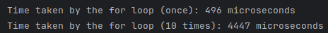
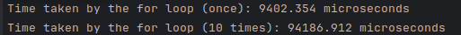
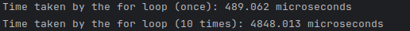

<!DOCTYPE html>
<html lang="en">
<head>
    <meta charset="UTF-8">
    <meta name="viewport" content="width=device-width, initial-scale=1.0">
    <title>Your Project Readme</title>
</head>
<body>

<h1>Basic Pybind Usage</h1>

This project contains C++ code using Pybind11 to expose a simple loop function to Python. The goal is to compare the performance of different implementations of the loop in Python and C++.

<h2>Files</h2>

<ol>
    <li><strong>forloop.cpp:</strong> C++ source code that defines a simple loop function.</li>
    <li><strong>forloop_w_default.py:</strong> Python script that demonstrates loop function without Pybind11.</li>
    <li><strong>forloop_w_pybind.py:</strong> Python script that uses the loop function exposed through Pybind11.</li>
    <li><strong>so.cpp:</strong> Pybind11 module source code that binds the C++ loop function for use in Python.</li>
    <li><strong>CMakeLists.txt:</strong> CMake file for building the project.</li>
    <li><strong>Images:</strong> Folder containing images illustrating the testing results for the loop function.</li>
</ol>

This project has the following dependencies:

<ul>
    <li><strong>Pybind11:</strong> A lightweight header-only library for creating Python bindings for C++ code.</li>
</ul>

<h3>Installing Dependencies</h3>

Use the provided shell script to install the dependencies. Ensure that you have the necessary build tools, such as CMake and a C++ compiler, installed on your system before running the script.

<pre>
curl -sSL https://raw.githubusercontent.com/bonj4/wiki/main/pybind11_installation.sh | bash
</pre>
<h2>Build Instructions</h2>

Make sure you have CMake installed.

<pre>
mkdir build
cd build
cmake ..
make
</pre>

<h2>Running Tests</h2>

<h3>1. C++ Loop (Once and 10 Times)</h3>

<pre>
g++ forloop.cpp
</pre>

<h3>2. Python Loop (Once and 10 Times)</h3>

<pre>
python forloop_default.py
</pre>

<h3>3. Python with Pybind Loop (Once and 10 Times)</h3>

<pre>
python forloop_w_pybind.py
</pre>

<h2>Testing Results</h2>

The <strong>Images</strong> folder contains visual representations of the testing results for each scenario. Refer to these images to analyze the performance of the different implementations.

<h3>C++ Loop</h3>

<h3>Python Loop</h3>

<h3>Python with Pybind Loop</h3>

<h2>Notes</h2>

<ul>
    <li>Ensure that you have the necessary dependencies installed.</li>
    <li>Feel free to modify the code for further experimentation.</li>
    <li>Report any issues or improvements in the <a href="https://github.com/bonj4/LoopPyBinder/issues">Issues</a> section.</li>
</ul>

</body>
</html>
